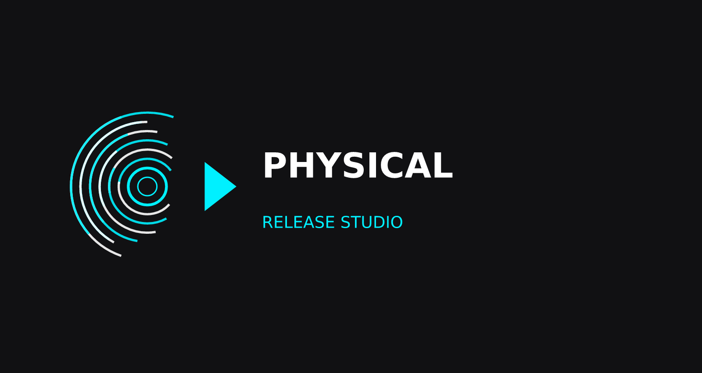

▶⁠ Physical Release Studio - Web-based Retro Game Packaging Suite

  

  <b>Preserving Video Game History — One Physical Release at a Time.</b> 
  An open-source, web-based suite of precision print layout tools for custom game covers, manuals, labels, big boxes, and auto-launchers.

  
  
  
  

---

## 💡 Intention & Vision

In an era dominated by digital distribution, physical game ownership is fading. **Physical Release Studio** was built with a clear purpose: to bridge the gap between digital preservation and tactile retro gaming culture. 

Whether you are restoring original cases from damaged secondhand finds, creating physical boxes for indie games, or making custom display shelf releases for GOG / digital-only games, this studio provides pixel-accurate, print-ready tools right in your browser — **no complex installation, heavy image editors, or subscription software required**.

---

## ✨ Key Features

- 🎯 **1:1 Scale Print Precision:** Pixel-accurate templates scaled specifically for authentic case dimensions (PAL PS1, Dreamcast double-jewel cases, Game Boy / NES / SNES boxes, manual booklets, etc.).
- 🔍 **Granular Controls:** Fine-grain zoom (0.1% steps) and micro-step arrow nudging (1px, 5px, 10px) for exact artwork positioning.
- 🚦 **Real-time DPI Quality Meter:** Visual traffic-light gauge (0–400+ DPI) instantly warns you if your source image resolution is too low for crisp printing.
- ✂️ **Notch Masking & Guidelines:** Automatic notch overlay clipping (e.g. Dreamcast PAL case cutouts) and toggleable cut-line guidelines.
- 🌐 **Bilingual (EN / DE):** Full multi-language interface with instant language toggling saved via `localStorage`.
- 🖨️ **1-Click PDF / Print Mode:** Rendered directly via HTML5 `<canvas>` at 300 DPI into browser-native print screens optimized for A4 paper.
- 📱 **Mobile & Desktop Ready:** Touch-drag interaction and responsive UI layout.

---

## 🛠️ Supported Studios & Modules

### 📦 Cover Studios
- **Sega Dreamcast (PAL):** Custom double jewel case inserts with 2.5cm hinge notch clipping (Back: 15.1 × 11.9 cm | Front: 12.0 × 12.0 cm).
- **PlayStation 1 (PAL):** Multi-disc thick PAL jewel case inserts (Back: 16.3 × 12.2 cm | Front: 12.5 × 12.7 cm).
- **More Platforms (Planned / In Progress):** Nintendo Switch, PS2, GameCube, Xbox, PC Big Boxes.

### 📖 Booklet Studio *(In Development)*
- Layout printable game manuals and multi-page retro booklet inserts with automatic saddle-stitch page imposition.

### 🏷️ Sticker Studio *(In Development)*
- Custom cartridge label generator for Game Boy, NES, SNES, N64, and Sega Genesis / Mega Drive.

### ✂️ Craft Studio *(In Development)*
- Printable fold-out templates for cardboard Big Boxes, Nintendo cartridge boxes, and protective slipcases.

### 🚀 GOG AutoLauncher & Extra Tools
- **GOG AutoLauncher:** Standalone auto-run wrappers for PC releases.
- **Materials & Affiliate Hub:** Recommended paper types (photopaper GSM specs), cutting tools, adhesive supplies, and replacement case sources.

---
